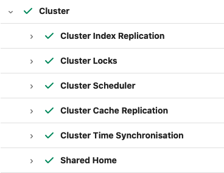

# Product scaling
For optimum performance and stability the appropriate resource `requests` and `limits` should be defined for each pod. The number of pods in the product cluster should also be carefully considered. Kubernetes provides means for horizontal and vertical scaling of the deployed pods within a cluster, these approaches are described below.

## Horizontal scaling - adding Pod's
The Helm charts provision one `StatefulSet` by default. The number of replicas within this `StatefulSet` can be altered either declaratively or imperatively. Note that the Ingress must support cookie-based session affinity in order for the products to work correctly in a multi-node configuration.


=== "Declaratively"
      1. Update `values.yaml` by modifying the `replicaCount` appropriately.
      2. Apply the patch:
      ```shell
      helm upgrade <release> <chart> -f <values file>
      ```

=== "Imperatively"
      ```shell
      kubectl scale statefulsets <statefulsetset-name> --replicas=n
      ```

!!!note "Initial cluster size"
      **Jira**, **Confluence**, and **Crowd** all require manual configuration after the first pod is deployed and before scaling up to additional pods, therefore when you deploy the product only one pod (replica) is created. The initial number of pods that should be started at deployment of each product is set in the `replicaCount` variable found in the values.yaml and should always be kept as 1.
      For details on modifying the `cpu` and `memory` requirements of the `StatfuleSet` see section [Vertical Scaling](#vertical-scaling-adding-resources) below. Additional details on the resource requests and limits used by the `StatfulSet` can be found in [Resource requests and limits](REQUESTS_AND_LIMITS.md) page.

### Scaling Jira safely
At present there are issues relating to index replication with Jira when immediately scaling up from `1` to `>=3` Jira Pod's.

* [Index replication service is paused indefinitely](https://jira.atlassian.com/browse/JRASERVER-72125)
* [Automatic restore of indexes will fail ](https://jira.atlassian.com/browse/JRASERVER-62669)

Although these issues are Jira specific, they are exasperated on account of the significalty reduced startup times for Jira when running in a Kubernetes cluster. As such they can have an impact on horizontal scaling if the approach describe below is not taken:

* Using either the `declarative` or `impreative` approach scale the cluster by **1 Pod only**
!!!warning "1 Pod as a time!"
      
      Ensure you only scale up by 1 Pod at a time!
  
* Make sure that the new Pod is running and has a state of `Running` 
* Log into the Jira instance as the `admin` user via the service URL
* Navigating to `System` > `Troubleshooting and support tools`
* Under the `Instance health` tab make sure that `Cluster Index Replication` has a green tick for example   



* Having confirmed the index is healthy proceed with adding additional Jira Pod's to the cluster by following the same steps as above.

## Vertical scaling - adding resources
The resource `requests` and `limits` for a `StatefulSet` can be defined before product deployment or for deployments that are already running within the Kubernetes cluster. Take note that vertical scaling will result in the pod being re-created with the updated values.

### Prior to deployment
Before performing a helm install update the appropriate products `values.yaml` `container` stanza with the desired `requests` and `limits` values i.e. 
```yaml
 container: 
  limits:
    cpu: "4"
    memory: "4G"
  requests:
    cpu: "2"
    memory: "2G"
```

### Post deployment
For existing deployments the `requests` and `limits` values can be dynamically updated either declaratively or imperatively 

=== "Declaratively"
      This the preferred approach as it keeps the state of the cluster, and the helm charts themselves in sync.
      
      1. Update `values.yaml` appropriately
      2. Apply the patch:
      
      ```shell
      helm upgrade <release> <chart> -f <values file>
      ```

=== "Imperatively"
      Using `kubectl edit` on the appropriate `StatefulSet` the respective `cpu` and `memory` values can be modified. Saving the changes will then result in the existing product pod(s) being re-provisioned with the updated values.
