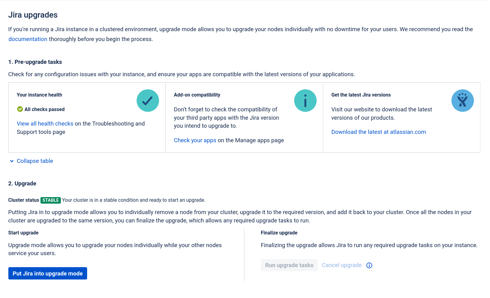
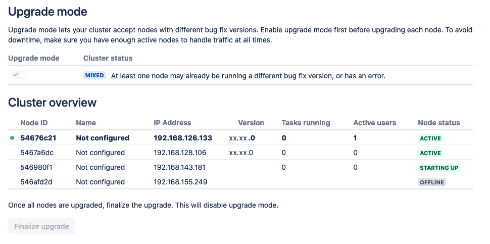
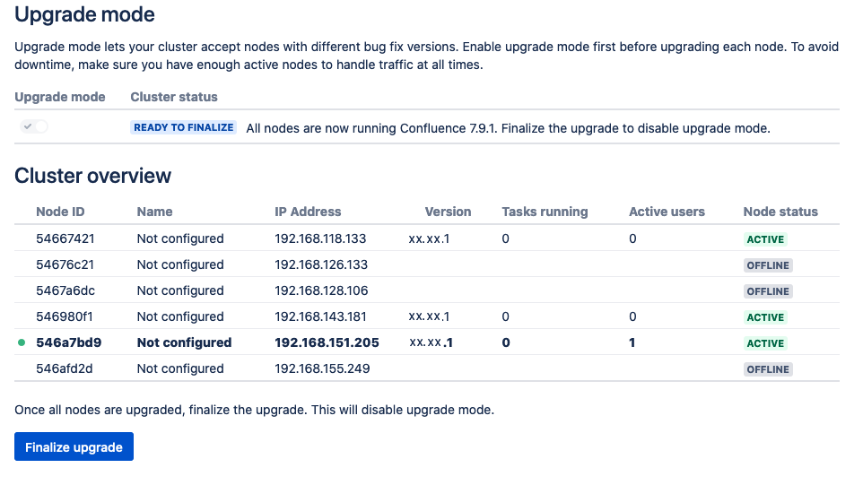
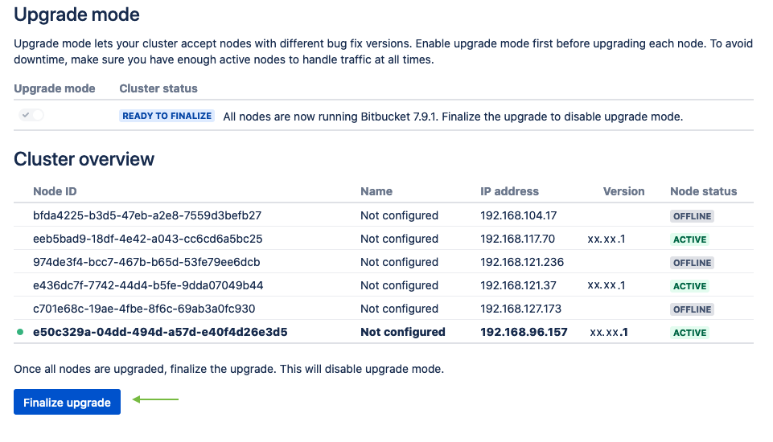

# Helm chart upgrade
Each Helm chart has a default product version that might change in next Helm chart 
version. So be aware that if you upgrade the Helm chart, it might lead to upgrading the product as well. This depends on the current and target Helm chart versions. 

!!!important "Do you want to upgrade the product to a new version?" 
     If you want to upgrade the product version without upgrading the Helm chart then 
     refer to [Product upgrades](PRODUCTS_UPGRADE.md). 

Before upgrading the Helm chart, first consider: 
* the version of the current Helm chart
* the version of the product running on your Kubernetes cluster
* the target version of the Helm chart you want to upgrade to
* the target version of the product you want to upgrade to

You need to know if the target product version is zero-downtime compatible (if it is subject to change). 
Based on this information you may need to choose a different upgrade method.

!!!info "Upgrade product strategies"
    There are two options for upgrade:
    
    * _Normal upgrade_: The service will have interruptions during the upgrade.
    * _Rolling upgrade_: The upgrade will proceed with zero downtime.
 

## 1. Find the current version of the installed Helm chart
To find the current version of Helm chart and the product version run the following command:

 ```shell 
 helm list --namespace <namespace> 
 ```

You can see the current Helm chart tag version in the `CHART` column, and the current product tag version in the `APP VERSION` 
column for each release name. 


## 2. Define the target Helm chart version
!!! hint "Do you have the Atlassian Helm chart repository locally?"
    Make sure you have the Atlassian Helm chart repository in your local Helm repositories. Run the following command to add them:
    
    ```shell
    helm repo add atlassian-data-center \
         https://atlassian.github.io/data-center-helm-charts
    ```

Update the Helm chart repository on your local Helm installation:

```shell 
helm repo update
```

!!! warning "Target Helm chart version"
    The target Helm chart version must be higher than the current Helm chart version.
    
To see all available Helm chart versions of the specific product run this command:

```shell 
helm search repo atlassian-data-center/<product> --versions
```

    
 Select the target Helm chart version. You can find the default application version (target product version tag) 
 in the `APP VERSION` column. 
  
 
## 3. Define the upgrade method

Considering the current and target **product** versions there are different scenarios: 

1. The versions are different, and the target product version is not zero-downtime compatible.  
2. The versions are different, and the target product version is zero-downtime compatible.  
3. The versions are the same.

 
!!!important "See the following links to find out if two versions of a product are zero-downtime compatible"

     Jira: [Upgrading Jira with zero downtime](https://confluence.atlassian.com/adminjiraserver/upgrading-jira-data-center-with-zero-downtime-938846953.html){.external}   
     Confluence: [Upgrading Confluence with zero downtime](https://confluence.atlassian.com/doc/upgrade-confluence-without-downtime-1027127923.html){.external}  
     Bitbucket: [Upgrading Bitbucket with zero downtime](https://confluence.atlassian.com/bitbucketserver/upgrade-bitbucket-without-downtime-1038780379.html){.external}

!!! note "All supported Jira versions are zero-downtime compatible"
     The minimum supported version of Jira Data Center in the Data Center Helm Charts is `8.19`. 
     Considering any Jira version later than 8.x is zero-downtime compatible, all supported Jira Data Center versions are zero-downtime
     compatible. 

Based on the scenario follow one of these options in the next step:

* **Normal upgrade**: Upgrade Helm chart when the target product version is not zero-downtime compatible, or you want 
to avoid mixed version during the upgrade. In this option the product will have a downtime during the upgrade process. 
* **Rolling upgrade**: Upgrade Helm chart when the target product version is zero-downtime compatible. This option 
will only apply when the target product version is zero-downtime compatible. If you are not sure about this see the links above. 
* **No product upgrade**: Upgrade the Helm chart with no change in product version. We recommend this method when the target product version is the same as the current product version, or for any other reason you may not want to change the product version but still upgrade the helm chart. 
 
 
## 4. Upgrade the Helm chart
 
!!! hint "Tip: Monitor the pods during the upgrade process"
     You can monitor the pod activities during the upgrade by running the following command in a separate terminal: 
     ```shell 
     kubectl get pods --namespace <namespace> --watch
     ```
      
=== "Normal upgrade"
    ### Helm chart upgrade with downtime
     
    You need to use this method to upgrade the Helm chart if:
    * the target product version is not zero downtime-compatible
    * for any other reason you would prefer to avoid running the cluster in mix mode
    
    !!!warning "Upgrading the Helm chart might change the product version" 
        If you want to upgrade the Helm chart to a newer version but don't want to change 
        the product version then follow the _Upgrade with no change in product version_ tab.
    
    The strategy for upgrading the product with downtime is to scale down the cluster to zero nodes and then 
    start the nodes with new product versions. And finally scale the cluster up to the original number of nodes. 
    Here are step-by-step instructions for the upgrade process:
    
    1. Find out the number of nodes in the cluster.
        ```shell
        kubectl describe sts <release-name> --namespace <namespace> | grep 'Replicas'
        ```
    2. Upgrade the Helm chart.  
        Replace the product name in the following command:
        ```shell
        helm upgrade <release-name> atlassian-data-center/<product> \
         --version <target-helm-chart-version>> \
         --reuse-values \
         --replicaCount=1 \
         --wait \
         --namespace <namespace>
        ```
        The cluster will scale down to zero nodes. Then one pod with the target product version will be recreated 
        and join the cluster. 
    
    3. Scale up the cluster.
        After you confirm the new pod is in `Running` status then scale up the cluster to the same number 
        of nodes as before the upgrade: 
        ```shell
        helm upgrade <release-name> atlassian-data-center/confluence \
         --reuse-values \
         --replicaCount=<n> \
         --wait \
         --namespace <namespace>
        ``` 


=== "Rolling upgrade"
         
    ### Helm chart upgrade with zero downtime
 
     
    !!!warning "Upgrade the Helm chart might change the product version" 
        If you want to upgrade the Helm chart to newer version but don't want to change 
        the product version then follow the _Upgrade with no change in product version_ tab.
        
    !!! warning "Rolling upgrade is not possible if the cluster has only one node"
         If you have just one node in the cluster then you can't take advantage of the zero-downtime approach. You may 
         scale up the cluster to at least two nodes before upgrading or there will be a downtime during the upgrade. 
              
    In order to upgrade the Helm chart when the target product version is different from the current product version, 
    you can use upgrade with zero downtime to avoid any service interruption during the upgrade.
    To use this option the target version must be zero-downtime compatible. 
    
    !!!important "Make sure the product target version is zero downtime-compatible" 
         To ensure you will have a smooth upgrade make sure the product target version is zero-downtime 
         compatible. If you still aren't sure about this go back to step 3. 

    
    Here are the step-by-step instructions of the upgrade process. These steps may vary for each product:
     

    === "Jira"
        1. Put Jira into upgrade mode. 
            Go to **Administration > Applications > Jira upgrades** and click **Put Jira into upgrade mode**. 
            
        
        2. Run the upgrade using Helm. 
        
            ```shell
            helm upgrade <release-name> atlassian-data-center/jira \
             --version <target-helm-chart-version>> \
             --reuse-values \
             --wait \
             --namespace <namespace>
            ```
        
        4. Wait for the upgrade to finish. 
            The pods will be recreated with the updated version, one at a time.
            
            
        
        3. Finalize the upgrade.
            After all the pods are active with the new version, click **Run upgrade tasks** to finalize the upgrade:
            
            
             
    === "Confluence"
         1. Put Confluence into upgrade mode. 
             From the admin page click on *Rolling Upgrade* and set the Confluence in Upgrade mode:
             
             
         
         2. Run the upgrade using Helm. 
             ```shell
             helm upgrade <release-name> atlassian-data-center/confluence \
                 --version <target-helm-chart-version>> \
                 --reuse-values \
                 --wait \
                 --namespace <namespace>
             ```
             Wait until all pods are recreated and are back to `Running` status. 
         
         4. Wait for the upgrade to finish. 
             The pods will be recreated with the updated version, one at a time.
             
             
         
         3. Finalize the upgrade. 
             After all the pods are active with the new version, click **Run upgrade tasks** to finalize the upgrade:
             
             
    
    === "Bitbucket"
        1. Put Bitbucket into upgrade mode. 
            From the admin page click on *Rolling Upgrade* and set the Bitbucket in Upgrade mode:
            
            
            
        2. Run the upgrade using Helm. 
        
            ```shell
            helm upgrade <release-name> atlassian-data-center/bitbucket \
             --version <target-helm-chart-version>> \
             --reuse-values \
             --wait \
             --namespace <namespace>
            ```
            Wait until all pods are recreated and are back to `Running` status. 
        
        3. Wait for the upgrade to finish. 
            The pods will be recreated with the updated version, one at a time.
            
            
            
        4. Finalize the upgrade. 
            After all the pods are active with the new version, click **Run upgrade tasks** to finalize the upgrade:
            
            

     
=== "Upgrade with no change in the product version"
    ###Helm chart upgrade with no change in product version  
    
    If your target Helm chart has a different product version in comparison with the current product version, and you 
    still want to keep the current product version unchanged, you should use the following command to upgrade the Helm chart:
    
    ```shell 
    helm upgrade <release-name> atlassian-data-center/<product> \
        --version <helm-chart-target-version> \
        --reuse-values \
        --set image.tag=<current-product-tag> \
        --wait \
        --namespace <namespace>
    ``` 
        
    However, when the product versions of target and current Helm charts are the same,
    then you can run the following command to upgrade the Helm chart only:
    
    ```shell 
    helm upgrade <release-name> atlassian-data-center/<product> \
         --version <helm-chart-target-version> \
         --reuse-values \
         --wait \
         --namespace <namespace>
    ```
