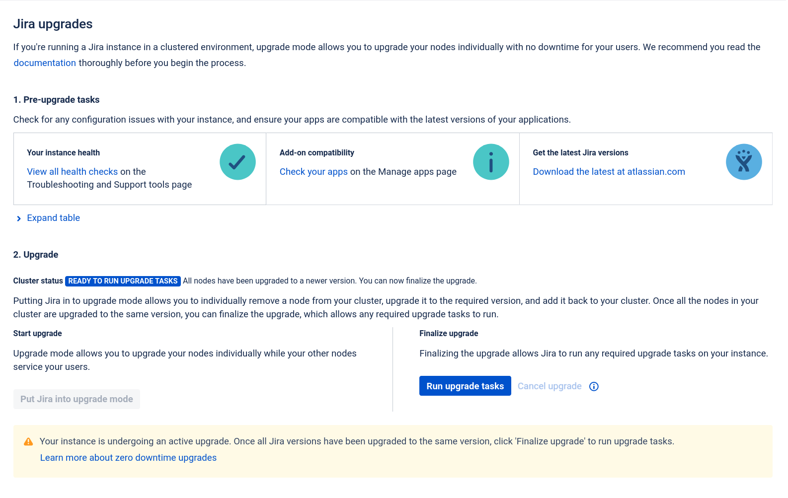
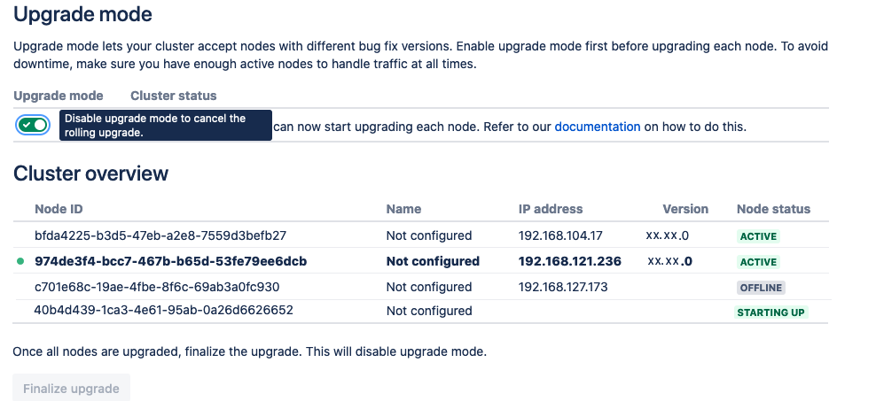

# Helm chart upgrade
Upgrading the Helm chart may or may not result in upgrading the product. 
This depends on the current and target Helm chart versions. 

!!!important "Do you want to upgrade the product to a specific version?" 
     If you want to upgrade the product version without upgrading the Helm chart, or to a product version that is not 
     listed in the helm charts then follow the [Product upgrades](PRODUCTS_UPGRADE.md). 

Before upgrading the Helm chart, first consider the versions of the current Helm chart and product 
that is already installed on your Kubernetes cluster, also the target versions of the Helm chart and product you want to upgrade. 
It is important you know that if upgrading from current product version to target product version is zero downtime compatible. 
Based on this factor you may need to choose a different method to upgrade.

!!!info "Upgrade strategies"
    There are two options for upgrade:
    
    * _Normal upgrade_: The service will interrupt during the upgrade.
    * _Rolling upgrade_: Upgrade will proceed with zero downtime.
 

## 1. Find the current version of the installed Helm chart
To find the current version of Helm chart and product version run the following command:

 ```shell 
 helm list --namespace <namespace> 
 ```

You can see the Helm chart tag version in `CHART` and product tag version in `APP VERSION` columns. 


## 2. Define the target Helm chart version
First update the Helm chart repository on your local Helm installation:

```shell 
helm repo update
```

Then you can see all available Helm chart versions of the specific product by running this command 
(replace the product name with `<product>`):

```shell 
helm search repo atlassian-data-center/<product> --versions
```
!!! warning "Target Helm chart version"
    The target Helm chart version must be higher than current Helm chart version.
 
Select the target Helm chart version. Based on the current and target Helm chart version the product 
version may or may not be different. There is not necessarily next version of Helm chart comes with a 
different product version. Here are three possible scenarios and based on each case you need to choose different method
to upgrade the Helm chart in step 3. 

**Possible upgrade scenarios:** 

1. The product versions are different, and they are not zero downtime compatible  
2. The product versions are different, but they are zero downtime compatible  
3. The product versions of current and target Helm chart are the same 

 
!!!important "See the following links to find out if two versions of product are zero downtime compatible"

     Jira: [Upgrading Jira with zero downtime](https://confluence.atlassian.com/adminjiraserver/upgrading-jira-data-center-with-zero-downtime-938846953.html){.external}   
     Confluence: [Upgrading Confluence with zero downtime](https://confluence.atlassian.com/doc/upgrade-confluence-without-downtime-1027127923.html){.external}  
     Bitbucket: [Upgrading Bitbucket with zero downtime](https://confluence.atlassian.com/bitbucketserver/upgrade-bitbucket-without-downtime-1038780379.html){.external}

!!! note "All supported jira versions are zero downtime compatible"
     The minimum supported version of Jira DC in Data Center Helm Charts is `8.19`. 
     Considering any jira version later than 8.x is zero downtime compatible, all supported Jira DC are zero downtime
     compatible. 
 
## 3. Upgrade the Helm chart

!!! hint "Tip: Monitor the pods during the upgrade process"
     You can monitor the pod activities during the upgrade by running the following command in separated terminal: 
     ```shell 
     kubectl get pods --namespace <namespace> --watch
     ```
Considering the current Helm chart version and target Helm chart version, and also current product version and target 
product version you may follow one of the following options:

* **Normal upgrade**: Upgrade Helm chart when the target product version is not zero downtime compatible, or you want 
to stop the service during the upgrade. In this option the product will have a downtime during the upgrade process. 
* **Rolling upgrade**: Upgrade Helm chart when the target product version is zero downtime compatible. This option will apply to only 
cases that the target product version is zero downtime compatible. If you are not sure about this please see the links
in step 2. 
* **No product upgrade**: Upgrade Helm chart with no change in product version. This method is recommending for the case the target Helm chart 
has the same product version as current Helm chart or for any reason you don't want to change the product version but 
still you like to upgrade the helm chart. 
 
=== "Normal upgrade"
    ### Helm chart upgrade with downtime
     
    You need to use this method to upgrade the Helm chart if:
    * The target product version is not zero downtime compatible
    * For any reason you prefer to avoid running the cluster in mix mode
    
    !!!important "Upgrade a Helm chart without upgrading the product version" 
        If you want to upgrade the Helm chart to newer version but do not want to change 
        the product version then please follow the first scenario in step 3.
    
    The strategy for upgrading the product with downtime is to scale down the cluster to zero nodes and then 
    start the nodes with new product versions. Finally scale the cluster up to the original number of nodes. 
    Here are the step by step instructions for upgrade process:
    
    1. Find out the current number of nodes
        run the following command and 
        ```shell
        kubectl describe sts <release-name> --namespace <namespace> | grep 'Replicas'
        ```
    2. Run the upgrade using the Helm
        Based on the product you want to upgrade replace the product name in the following command and run:
        ```shell
        helm upgrade <release-name> atlassian-data-center/<product> \
         --version <target-helm-chart-version>> \
         --reuse-values \
         --replicaCount=1 \
         --wait \
         --namespace <namespace>
        ```
        The cluster will scale down to zero nodes. Then one pod with the target product version will be recreated 
        and join the cluster. 
    
    3. Scale up the cluster
        After you confirm the new pod is in `Running` status then scale up the cluster to the same number 
        of nodes as before the upgrade: 
        ```shell
        helm upgrade <release-name> atlassian-data-center/confluence \
         --reuse-values \
         --replicaCount=<n> \
         --wait \
         --namespace <namespace>
        ``` 


=== "Rolling upgrade"
         
    ### Helm chart upgrade with zero downtime
 
    !!! warning "Rolling upgrade is not possible if the cluster has only one node!"
         If you have just one node in the cluster then you cannot take advantage of the zero downtime approach. You may 
         scale up the cluster to at least two nodes before upgrade or there will be a downtime during the upgrade. 
              
    In order to upgrade the Helm chart when the product version of the target is different from the current product version, 
    you can use upgrade with zero downtime to avoid any service interrupt during the ugprage.
    To use this option the target version should be zero downtime compatible. 
    
    !!!important "Make sure the product target version is zero downtime compatible" 
         To ensure you will have a smooth upgrade please make sure the product target version is zero downtime 
         compatible. If you still are not sure about this return to step 2 please. 
    
    !!!important "Upgrade a Helm chart without upgrading the product version" 
         If you want to upgrade the Helm chart to newer version but do not want to change 
         the product version then please follow the first scenario in step 3.
    
    Here are the step by step instructions for the upgrade process. These steps may vary for each product:
     

    === "Jira"
        1. Put Jira into upgrade mode 
            Go to **Administration > Applications > Jira upgrades** and click **Put Jira into upgrade mode**. 
            
        
        2. Run the upgrade using the Helm 
        
            ```shell
            helm upgrade <release-name> atlassian-data-center/jira \
             --version <target-helm-chart-version>> \
             --reuse-values \
             --wait \
             --namespace <namespace>
            ```
        
        4. Wait for the upgrade to finish 
            The pods will be re-created with the updated version, one at a time.
            
            
        
        3. Finalize the upgrade 
            After all pods are active with the new version, click **Run upgrade tasks** to finalize the upgrade:
            
            
             
    === "Confluence"
         1. Put Confluence into upgrade mode 
             From the admin page click on *Rolling Upgrade* and set the Confluence in Upgrade mode:
             
             
         
         2. Run the upgrade using the Helm 
             ```shell
             helm upgrade <release-name> atlassian-data-center/confluence \
                 --version <target-helm-chart-version>> \
                 --reuse-values \
                 --wait \
                 --namespace <namespace>
             ```
             Wait until all pods are re-created and back to `Running` status 
         
         4. Wait for the upgrade to finish 
             The pods will be re-created with the updated version, one at a time.
             
             
         
         3. Finalize the upgrade 
             After all pods are active with the new version, click **Run upgrade tasks** to finalize the upgrade:
             
             
    
    === "Bitbucket"
        1. Put Bitbucket into upgrade mode 
            From the admin page click on *Rolling Upgrade* and set the Confluence in Upgrade mode:
            
            
            
        2. Run the upgrade using the Helm 
        
            ```shell
            helm upgrade <release-name> atlassian-data-center/bitbucket \
             --version <target-helm-chart-version>> \
             --reuse-values \
             --wait \
             --namespace <namespace>
            ```
            Wait until all pods are re-created and back to `Running` status 
        
        3. Wait for the upgrade to finish 
            The pods will be re-created with the updated version, one at a time.
            
            
            
        4. Finalize the upgrade 
            After all pods are active with the new version, click **Run upgrade tasks** to finalize the upgrade:
            
            

     
=== "Upgrade with no change in the product version"
    ###Helm chart upgrade with no change in product version  
    
    If your target Helm chart has a different product version in comparison with the current product version and you 
    still want to keep the current product version unchanged, you should use the following command to upgrade Helm chart:
    
    ```shell 
    helm upgrade <release-name> atlassian-data-center/<product> \
        --version <helm-chart-target-version> \
        --reuse-values \
        --set image.tag=<current-product-tag> \
        --wait \
        --namespace <namespace>
    ``` 
        
    However, when the product versions of target and current Helm charts are the same,
    then you can run the following command to upgrade the Helm chart olny:
    
    ```shell 
    helm upgrade <release-name> atlassian-data-center/<product> \
         --version <helm-chart-target-version> \
         --reuse-values \
         --wait \
         --namespace <namespace>
    ```
